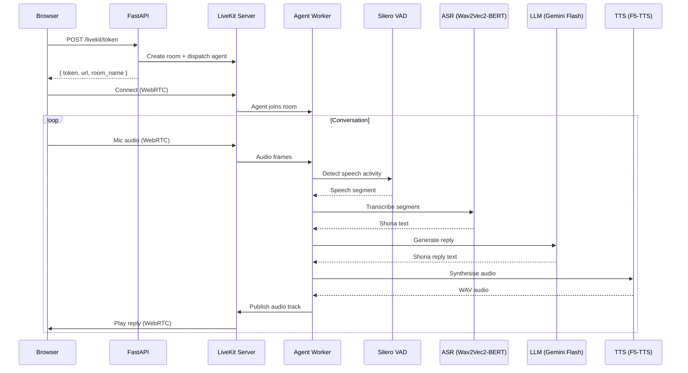

# Ashona — Shona Speech-to-Speech Voice Assistant

A real-time, fully local speech-to-speech (S2S) pipeline for **Shona** (chiShona). Ashona chains a fine-tuned ASR model, a Gemini Flash LLM, and a local TTS model into a conversational voice assistant—orchestrated end-to-end by a self-hosted [LiveKit](https://livekit.io/) server.

> **Key idea:** every speech component (ASR and TTS) runs locally on your own hardware; only the LLM reasoning step calls out to the Gemini API (or a local LLM). LiveKit handles room management, WebRTC transport, VAD, and turn detection so the pipeline feels like a natural conversation.

---

## Architecture Overview

```
┌─────────────────────────────────────────────────────────────────────────┐
│                          Browser  (s2s.client)                         │
│                                                                        │
│   ┌────────────┐    ┌──────────────┐    ┌───────────────────────────┐  │
│   │ ASR Panel  │    │  TTS Panel   │    │   S2S Panel (LiveKit)     │  │
│   │ VoiceInput │    │  textarea →  │    │  ShaderOrb + livekit-     │  │
│   │ upload/mic │    │  /tts API    │    │  client WebRTC room       │  │
│   └─────┬──────┘    └──────┬───────┘    └────────────┬──────────────┘  │
│         │                  │                         │                 │
└─────────┼──────────────────┼─────────────────────────┼─────────────────┘
          │  HTTP            │ HTTP                    │ WebRTC (audio)
          ▼                  ▼                         ▼
┌─────────────────────────────────────────────────────────────────────────┐
│                       FastAPI  (s2s.server/main.py)                     │
│                                                                        │
│   POST /asr          POST /tts        POST /livekit/token              │
│   POST /s2s          POST /s2s/reset  WS   /s2s/live                   │
└───────────┬──────────────┬────────────────────┬────────────────────────┘
            │              │                    │
            ▼              ▼                    ▼
     ┌────────────┐  ┌───────────┐  ┌───────────────────────────────────┐
     │ ASR Engine │  │TTS Engine │  │  LiveKit Server  (Docker)         │
     │ Wav2Vec2-  │  │ F5-TTS    │  │  ws://127.0.0.1:7880              │
     │ BERT / Sna │  │ (Shona)   │  │                                   │
     │ Whisper    │  │           │  │  ┌─────────────────────────────┐  │
     └────────────┘  └───────────┘  │  │  LiveKit Agent Worker       │  │
                                    │  │  (livekit_chain.py)          │  │
                                    │  │                              │  │
                                    │  │  Silero VAD                  │  │
                                    │  │    ↓                         │  │
                                    │  │  LocalASRSTT (Wav2Vec2-BERT) │  │
                                    │  │    ↓                         │  │
                                    │  │  GeminiTextLLM (Gemini Flash)│  │
                                    │  │    ↓                         │  │
                                    │  │  LocalTTS (F5-TTS)           │  │
                                    │  └─────────────────────────────┘  │
                                    └───────────────────────────────────┘
```

---

## Project Structure

```
sna-s2s/
├── package.json              # Root workspace — concurrently runs server + worker + client
├── ops/
│   └── livekit/
│       ├── compose.yml       # Docker Compose for the local LiveKit server
│       └── .env.example      # LiveKit key/secret template
├── s2s.server/               # Python backend (FastAPI + LiveKit agent)
│   ├── main.py               # FastAPI app — /asr, /tts, /s2s, /livekit/token endpoints
│   ├── asr.py                # ASREngine (Wav2Vec2-BERT CTC) + WhisperEngine
│   ├── tts.py                # TTSEngine wrapping F5-TTS (Shona fine-tune)
│   ├── llm.py                # LLMClient — Gemini Flash (or local OpenAI-compat LLM)
│   ├── livekit_chain.py      # LiveKit Agents worker — chains ASR → LLM → TTS
│   ├── live_s2s.py           # WebSocket bridge for Gemini Live audio mode
│   ├── live_probe.py         # Diagnostic script to test Gemini Live connections
│   ├── generate_intro_audio.py  # Pre-renders the Shona greeting WAV for the client
│   ├── pyproject.toml        # Python dependencies (uv / pip)
│   └── voice.wav             # Reference voice sample
└── s2s.client/               # React frontend (Vite + TanStack Start)
    ├── src/
    │   ├── routes/index.tsx      # Main page — tabbed ASR / TTS / S2S panels
    │   ├── components/
    │   │   ├── s2s-panel.tsx     # LiveKit-powered real-time S2S conversation UI
    │   │   ├── shader-orb.tsx    # WebGL orb visualiser for conversation state
    │   │   └── voice-input.tsx   # Push-to-talk mic component (VAD-assisted)
    │   └── lib/actions/
    │       ├── asr.ts            # Client → POST /asr
    │       ├── tts.ts            # Client → POST /tts
    │       ├── s2s.ts            # Client → POST /s2s (one-shot pipeline)
    │       └── livekit.ts        # Client → POST /livekit/token
    └── public/
        └── livekit-intro.wav     # Pre-rendered intro greeting audio
```

---

## Components In Depth

### ASR — Automatic Speech Recognition

Two interchangeable ASR backends are supported, selected via `ASR_BACKEND`:

| Backend | Model | Architecture | Detail |
|---------|-------|--------------|--------|
| `w2v` (default) | `w2v-bert-sna` | Wav2Vec2-BERT CTC | Fine-tuned on Shona; best for Shona-only transcription |
| `whisper` | `sna-whisper-asr` | Whisper (Seq2Seq) | Shona–English fine-tune of Whisper Turbo |

Both engines:
- Accept raw audio bytes (WAV, WebM, OGG — any format ffmpeg can decode)
- Resample to **16 kHz mono** via ffmpeg subprocess
- Chunk long audio into **25-second** windows to prevent OOM
- Detect silence and skip empty chunks

Model weights are loaded from local disk paths (configurable via `ASR_W2V_PATH` / `ASR_WHISPER_PATH`).

### TTS — Text-to-Speech

The TTS engine wraps **F5-TTS**, a diffusion-based text-to-speech model fine-tuned for Shona. F5-TTS generates high-quality, natural-sounding speech using a flow-matching architecture with a reference voice prompt.

- Loaded once at startup from local checkpoints
- Input: Shona text string + reference voice sample (`voice.wav`)
- Output: 16-bit PCM WAV bytes at the model's native sample rate
- Runs on CUDA / MPS / CPU with automatic device selection

### LLM — Language Model

The `LLMClient` class supports two backends:

| Backend | Model | Provider |
|---------|-------|----------|
| `gemini` (default) | `gemini-3.1-flash-lite-preview` | Google Gemini API |
| `local` | Any OpenAI-compatible model (e.g. `tiny-aya-earth`) | Local inference server (LM Studio, vLLM, etc.) |

The LLM is system-prompted to respond **exclusively in simple, modern Shona**. It maintains lightweight per-session conversation history and applies post-processing to strip digits and subtitle artifacts from responses. Temperature is set to `0.6` with a 256-token output cap to keep replies short and TTS-friendly.

### LiveKit Orchestration

The real-time S2S experience is powered by a **self-hosted LiveKit server** running in Docker, with a Python **LiveKit Agents worker** that wires everything together:

#### LiveKit Server (Docker)
```yaml
# ops/livekit/compose.yml
services:
  livekit:
    image: livekit/livekit-server:latest
    ports:
      - "7880:7880"   # WebSocket signalling
      - "7881:7881"   # HTTP API
      - "7882:7882/udp"  # WebRTC media
```

#### LiveKit Agent Worker (`livekit_chain.py`)

The worker registers as `sna-livekit-chain` and is dispatched into a room when the client requests a session. It chains four LiveKit adapter classes:

1. **Silero VAD** — Voice Activity Detection with tuned sensitivity thresholds:
   - `min_silence_duration`: 450ms
   - `activation_threshold`: 0.55
   - `prefix_padding_duration`: 350ms

2. **`LocalASRSTT`** — LiveKit `stt.STT` adapter wrapping the local Wav2Vec2-BERT / Whisper engine. Combines incoming audio frames, converts to WAV, and runs transcription in a thread pool.

3. **`GeminiTextLLM`** — LiveKit `llm.LLM` adapter that calls Gemini Flash for text generation. Passes the full chat context and applies Shona system instructions with minimal thinking mode enabled.

4. **`LocalTTS`** — LiveKit `tts.TTS` adapter wrapping F5-TTS. Synthesises the LLM reply into WAV audio and streams it back to the room.

#### Turn Detection & Interruption

LiveKit's agent session manages conversational turn-taking with dynamic endpointing:

```python
turn_handling={
    "endpointing": {
        "mode": "dynamic",
        "min_delay": 0.5,   # seconds
        "max_delay": 1.8,
    },
    "interruption": {
        "enabled": True,
        "mode": "adaptive",
        "min_duration": 0.4,
        "resume_false_interruption": True,
    },
}
```

This means:
- The system waits between **0.5–1.8 seconds** of silence before concluding a user turn
- Users can **interrupt** the assistant mid-speech; the assistant resumes if the interruption was accidental
- Preemptive generation is disabled to avoid wasting compute on speculative responses

### Client — React Frontend

The client is a **Vite + TanStack Start** app with three tabbed panels:

| Tab | Description |
|-----|-------------|
| **Speech Recognition** | Push-to-talk mic or file upload → ASR transcription |
| **Text to Speech** | Textarea input → F5-TTS synthesis with waveform visualiser |
| **Speech to Speech** | Real-time LiveKit conversation with animated WebGL orb |

The S2S panel (`s2s-panel.tsx`) manages the full LiveKit lifecycle:
1. Requests a room token from `POST /livekit/token` (which also dispatches the agent)
2. Connects to the LiveKit room via `livekit-client` WebRTC
3. Enables the local microphone and subscribes to remote audio tracks
4. Tracks `ActiveSpeakersChanged` events to transition between phases: **idle → listening → processing → speaking**
5. Drives a `ShaderOrb` WebGL visualiser that animates based on conversation state

---

## Prerequisites

| Dependency | Version | Purpose |
|------------|---------|---------|
| Python | ≥ 3.11 | Server + agent worker |
| [uv](https://docs.astral.sh/uv/) | latest | Python package manager |
| Node.js | ≥ 18 | Client dev server |
| [Bun](https://bun.sh/) | latest | Client package manager & runner |
| Docker | latest | LiveKit server container |
| ffmpeg | latest | Audio decoding in ASR pipeline |
| CUDA / MPS | — | GPU acceleration (optional, falls back to CPU) |

### Local Model Weights

Download and place the following model checkpoints on your machine:

| Model | Default Path | Notes |
|-------|-------------|-------|
| Wav2Vec2-BERT (Shona) | `/Users/<you>/models/shona/w2v-bert-sna` | Fine-tuned CTC model |
| Whisper (Shona) | `/Users/<you>/models/shona/sna-whisper-asr` | Optional alternative ASR |
| F5-TTS (Shona) | `/Users/<you>/models/shona/f5-tts-sna` | Diffusion-based TTS fine-tune |

Override paths via environment variables: `ASR_W2V_PATH`, `ASR_WHISPER_PATH`, `TTS_MODEL_PATH`.

---

## Setup

### 1. Clone & install

```bash
git clone <repo-url> && cd sna-s2s

# Install root workspace (concurrently)
bun install

# Install client dependencies
cd s2s.client && bun install && cd ..

# Install server dependencies
cd s2s.server && uv sync && cd ..
```

### 2. Start the LiveKit server

```bash
cd ops/livekit
cp .env.example .env    # edit keys if needed
docker compose up -d
```

The server listens on `ws://127.0.0.1:7880`.

### 3. Configure the server environment

```bash
cd s2s.server
cp .env.example .env    # or create from scratch
```

Required variables:

```env
# Gemini
GEMINI_API_KEY=your-key

# LiveKit
LIVEKIT_URL=ws://127.0.0.1:7880
LIVEKIT_API_KEY=devkey
LIVEKIT_API_SECRET=your-secret

# ASR backend: "w2v" (default) or "whisper"
ASR_BACKEND=w2v

# Optional: local LLM instead of Gemini
# LLM_BACKEND=local
# LOCAL_LLM_MODEL=tiny-aya-earth
# LOCAL_LLM_BASE_URL=http://127.0.0.1:1234/v1
```

### 4. Generate the intro greeting audio

```bash
cd s2s.server
uv run python generate_intro_audio.py
```

This renders the Shona intro greeting to `s2s.client/public/livekit-intro.wav`.

### 5. Run everything

From the repo root:

```bash
bun run dev
```

This concurrently starts:

| Process | Command | Port |
|---------|---------|------|
| **FastAPI server** | `uvicorn main:app --reload` | `8000` |
| **LiveKit agent worker** | `python3 livekit_chain.py dev` | — |
| **Vite dev server** | `vite dev` | `3000` |

Open [http://localhost:3000](http://localhost:3000) and navigate to the **Speech to Speech** tab.

---

## API Reference

### `POST /asr`

Transcribe audio with the configured ASR backend.

- **Body:** `multipart/form-data` with a `file` field
- **Response:** `{ "text": "transcribed shona text" }`

### `POST /tts`

Synthesise Shona text to speech.

- **Body:** `{ "text": "Mhoro shamwari" }`
- **Response:** `audio/wav` stream

### `POST /s2s`

Full speech-to-speech in one request: ASR → LLM → TTS.

- **Body:** `multipart/form-data` with a `file` field
- **Response:** `{ "wav_base64": "...", "transcript": "...", "reply": "..." }`

### `POST /s2s/reset`

Clear the LLM conversation context.

- **Response:** `{ "status": "ok" }`

### `POST /livekit/token`

Mint a LiveKit room token and dispatch the agent worker.

- **Body:** `{ "room_name": "optional-name" }` (optional)
- **Response:** `{ "token": "jwt", "url": "ws://...", "room_name": "...", "participant_identity": "..." }`

### `WS /s2s/live`

WebSocket bridge for Gemini Live audio mode with local TTS playback. Streams raw PCM audio in both directions and sends JSON events for transcription, reply, and turn completion.

---

## Data Flow — LiveKit S2S Session



---

## License

This project is part of the HIT400 research programme. See the individual model licences for Wav2Vec2-BERT, F5-TTS, and Whisper.
